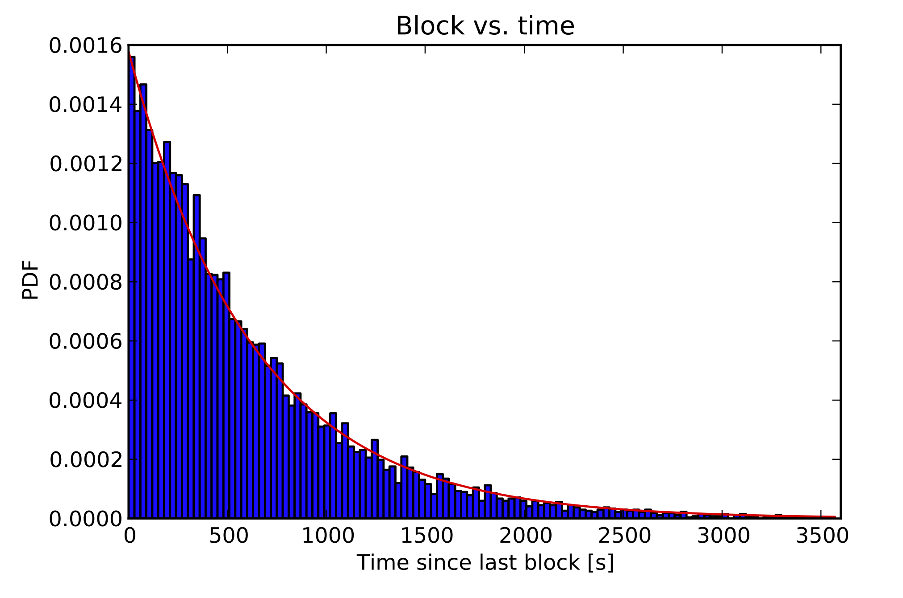
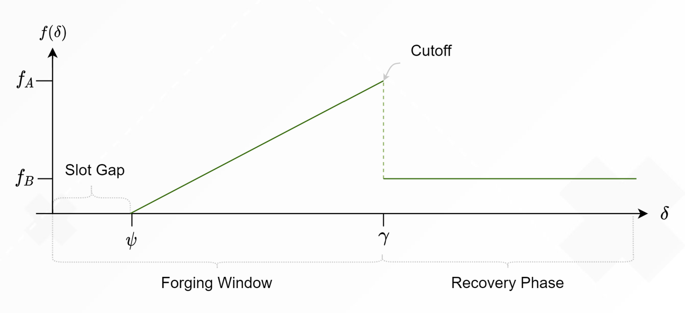
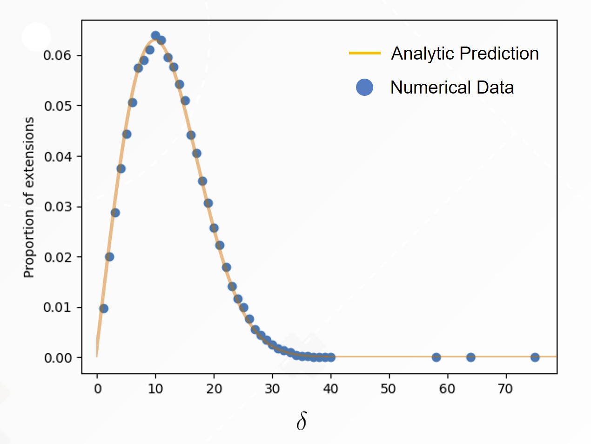
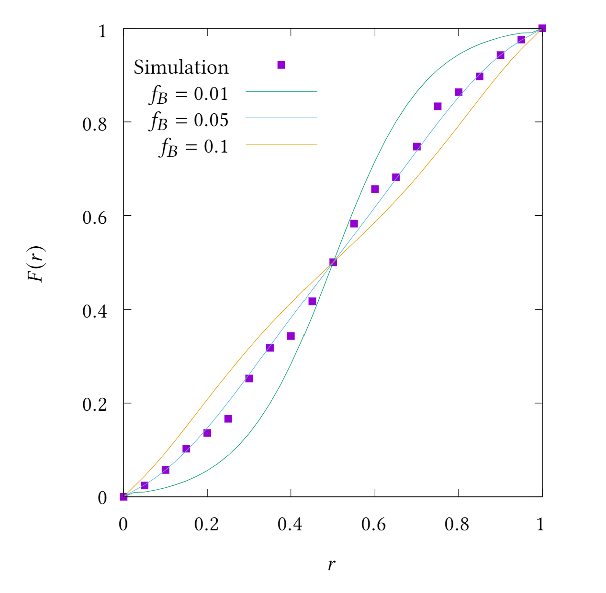

# Taktikos PoS

A blockchain’s consensus algorithm plays a crucial role in its overall design. Directly, the consensus algorithm is the set of rules governing block-producing nodes. Indirectly, a blockchain’s choice of consensus algorithm determines its energy footprint and influences transaction speed, throughput, and finality, and level of decentralization.

The centrality of blockchain consensus leads protocol designers to look to closely balance solid fundamentals with promising advances. This is exactly what Topl’s team sought to (and has) achieved with the creation of Taktikos, the first _regularized Nakamoto consensus protocol_ [^1].

### Foundation

Taktikos is built from the foundation established by IOHK in [Ouroboros Praos](https://eprint.iacr.org/2017/573.pdf), and as such inherits key advantages:

* As a pure Nakamoto-style protocol, Taktikos consensus remains robust and can continue to produce blocks with only $>\frac{1}{2}$ honest stake. This is in contrast with BFT protocols that can remain in consensus only if more than $>\frac{2}{3}$ of the network’s stake is honest.
* Taktikos can make use of a _dynamically available and fully permissionless_ set of stakers with no fundamental maximum on the set of active block producers (as is the case for EOS), or even minimum thresholds for stake ownership (as in Ethereum’s Casper design).
* Among Praos’s key advantages is a provably secure consensus model that does not rely on any trusted execution environments or other hardware-related assumptions. Leveraging a cryptographic construction known as _verifiable random functions_ (VRFs), Praos and later algorithms such as Taktikos do not need to be concerned with hardware advancements that may render them insecure, as is the case with algorithms (such as Ethereum’s Casper and Proof of Time used by Chia) that rely on the alternative construction of _verifiable delay functions_ (VDFs).
* Praos and the larger family of Ouroboros consensus algorithms have been formulated, studied, and verified under the cryptography framework of _universal composability_ (UC). Not only does such a formulation deliver an unsurpassed standard of rigor to security assumptions, it ensures that the base protocol can be _composed_ with additional protocols to extend functionality or interoperate.

### Long-tails and slot-based consensus

One of the key drawbacks of Nakamoto consensus has been high variability in the timing of block production. While the average block time for Bitcoin is set at 10 minutes, this is only an average, and there is a longtail where a new block may not arrive for hours.

*Probability Density Function (PDF) of block time intervals in the Bitcoin network, showing an exponential profile characteristic of the statistical independence of valid proofs discovered in the mining process. Reference: C. Decker and R. Wattenhofer, "Information propagation in the Bitcoin network," IEEE P2P 2013 Proceedings, 2013, pp. 1-10, doi: 10.1109/P2P.2013.6688704.*

This exponential distribution can be found across blockchains leveraging Nakamoto consensus, as the process of block creation relies on applying a (near) constant probability from one block to another that a new block is produced in any single moment. Not only does this introduce the problem that the blockchain network will occasionally _stall_, failing to confirm new transactions for an extended period, but it can incentivize centralization where block producers can benefit from grouping themselves geographically. This was exactly the behavior that was realized with the so-call _slot battles_ in Cardano ([reference](https://forum.cardano.org/t/slot-battles-what-do-they-look-like-what-can-be-done-about-them/41316)).

To solve this problem, Topl developed Taktikos. The  innovation of Taktikos is the introduction of what we have dubbed, _local dynamic difficulty_. Like other proof-of-stake consensus protocols, Taktikos is _round based_, meaning that blocks are created and added in set rounds, with forgers each having a stake-dependent probability of producing a valid block to extend the chain in each slot. However, Taktikos is unique in that the probability of block creation is not constant and uses slots to act as a clock to evolve the difficulty of producing a block over time. The goal of this perturbation is to regularize production of new blocks so that blockchain stalls are minimized.

While many potential difficulty curves were considered and simulated, one curve in particular stands out for the chain growth and security properties it produces, the _snowplow curve_ (below).

*The time between blocks is shown on the x-axis, the y-axis corresponds to the value of the active slot coefficient, or difficulty, at a given slot interval $\delta$.*

The snowplow curve allows for blocks to be produced across two distinct periods, the Forging Window and the Recovery Phase. The effect of this curve with a a notable discontinuity between the two periods (the Cutoff), is to transform the distribution of new block production from the exponential distribution found in other protocols to a tight bell curve(-like) distribution, named the Taktikkos distribution, centered around the average block time.

*A sample distribution function produced by Taktikos. The distribution goes to zero as $\delta$ approaches zero producing significantly fewer asynchronous extensions, or network stalls. The difficulty curve parameters in this example are $\gamma = 40$, $\Psi = 0$, $fA = 0.4$, and $fB = 0.05$.*

Beyond more predictable block production, the introduction of Taktikos yields improved chain growth properties that in turn provide faster _transaction finality_, increased _transaction throughput_, and reduced _adversarial influence_. The complete methods by which these benefits are achieved will be detailed in future work. We will describe them more briefly now.

Faster transaction finality is realized directly through the novel block distribution shown above. Simply put, because the vast majority of blocks are produced within a tight window of time immediately centered on the average block time, the probability that a transaction has been included on anything other than the canonical chain is substantially less than would be the case if blocks were produced according to the more standard exponential distribution. In the case of an exponential distribution describing block production, a transaction will often be included in either a block that is produced too quickly as to fall below the average network delay and thus have a higher probability of being _reorged_ out, or be relegated into a block that does not get added for an expended period.

Turning to the matter of throughput, the consideration becomes efficiency. Namely, the Taktikos distribution for block production enables blocks to be filled more efficiently. Since block production according to a Taktikos distribution results in fewer block reorgs (for a given block time), transactions are included in fewer blocks on average. As transactions are included in fewer blocks, there is comparatively more space available for non-redundant transactions, thus increasing overall throughput.

Finally, and perhaps most interestingly, the introduction of local dynamic difficulty according to the snowplow curve reduces the power of adversarial actors in the system. Returning to the snowplow curve and Taktikos distribution, we observe that the period shortly following the production of a block, also known as the forging window, is responsible for the vast majority of block production given the lower difficulty at the beginning of that window. Another way to think about this is to recognize that “blocks beget blocks.”

The result of blocks begetting blocks is to see that any adversary attempting to subvert the canonical chain by only extending on their own tine (ignoring blocks produced by other nodes) will have a distinct disadvantage in creating blocks even for slots where they would otherwise be eligible to extend the chain because they will probabilistically never be eligible to forge while still in the Forging Window from their previously minted block. The effect of this is that with proper parameterizations, Taktikos will diminish the power of any adversary (with less than 50% of active stake) to equal to less than the influence they would have if they were to behave honestly.

*In this plot we see that the power of a network adversary can be tuned based on the fB, or the difficulty of block production during the Recovery Period.*

In summary, while there are several lines of potential further exploration for Taktikos, we believe that parametrizations already obtained and currently being implemented into the Topl Blockchain offer notable improvements in transaction finality, network throughput, and security compared to other POS protocols, all while retaining the strong fundamentals of Ouroboros Praos.

[^1]: The term _Nakamoto consensus_ describes an incentive-driven, probabilistic consensus algorithm where chain extension eligibility is determined via a race condition, originally presented in the [Bitcoin whitepaper](https://bitcoin.org/bitcoin.pdf).
